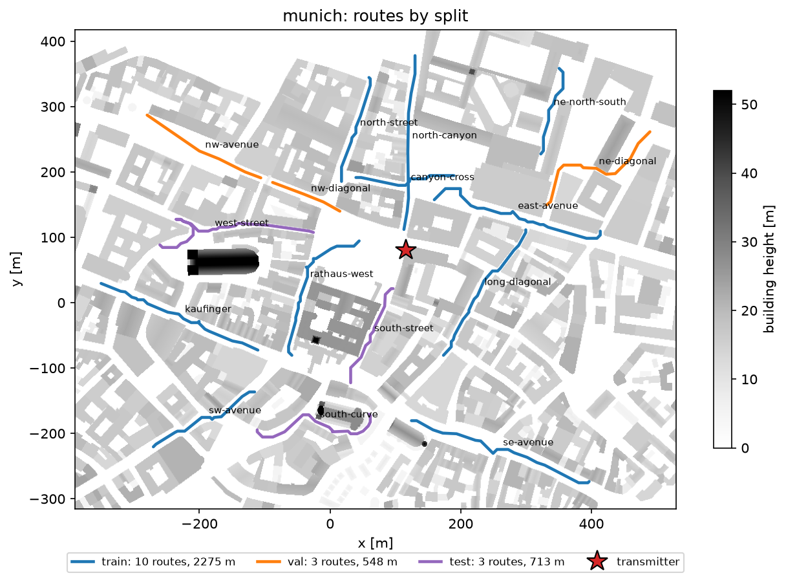

# Channels

Since linkgym 0.2.0.

The channel of an episode is a linear power gain |h|^2 per slot and per PRB. The
simulator turns it into the per-PRB SINR

```
sinr = 10 ** (snr_db / 10) * gain
```

where `snr_db` is the scenario SNR, or a reference SNR set by the channel source (link
budget, below). Two sources are built in, chosen with the `channel` scenario field:

- `channel="tdl"` (default): 3GPP TR 38.901 TDL fading generated with Sionna, as in
  v0.1.
- `channel="trace"`: gains read from an HDF5 trace file (`trace_path`), for example
  computed offline by ray tracing along UE trajectories, or measured.

## Channel source interface

`linkgym.channels.ChannelSource` is the extension point for other channel models. It is
a stable interface. A source has:

- `num_prbs`: the number of PRBs of the gains it returns;
- `generate(num_slots, batch_size, seed) -> ChannelEpisode`.

`ChannelEpisode` has three fields:

| field | content |
|---|---|
| `gain` | float32 tensor [batch_size, num_slots, num_prbs], always the linear power gain, finite and non-negative |
| `reference_snr_db` | `None`: the simulator uses the scenario SNR, and the gain should have unit mean. A float, or a [batch_size] array: the simulator uses that SNR instead. |
| `info` | metadata, one JSON-serializable list entry per link, e.g. the trajectory index |

`generate` must depend only on its arguments: use `seed` for all randomness and do not
read or modify global random state. A source can be passed to
`linkgym.sim.LinkSimulator(..., channel_source=source)`. The environment builds its
source from the scenario; to use your own channel in the environment, write it to a
trace file (see [Bring your own channel](#bring-your-own-channel)).

`linkgym.sim.TDLChannelGain` is the TDL source: the power delay profile is normalized,
so the gain has unit mean and the scenario SNR is the mean SNR. It samples the channel
at one frequency per PRB, spaced by the PRB bandwidth, once per slot.

## Trace format, version 1

A trace is an HDF5 file holding T trajectories of N consecutive slots each. Write it
with `linkgym.channels.write_trace` and read it with `read_trace`; both validate it.

Root attributes:

| attribute | type | value |
|---|---|---|
| `format` | str | `"linkgym-trace"` |
| `format_version` | int | `1` |
| `gain_unit` | str | `"linear_power_gain"` |
| `carrier_frequency_hz` | float | carrier frequency [Hz] |
| `subcarrier_spacing_hz` | float | subcarrier spacing [Hz] |
| `slot_duration_s` | float | time between consecutive slots [s] (0.5e-3 at 30 kHz) |
| `num_prb` | int | number of PRBs, equal to the last dimension of `gain` |
| `prb_sampling` | str | `"center"` (one frequency point per PRB) or `"mean12"` (mean over the 12 subcarriers of the PRB) |

Other attributes (for example the scene or the generator versions) are allowed and kept
in `TraceData.attrs` and `TraceInfo.attrs`; the attributes written by the Sionna RT
generator are listed in [Generating traces with Sionna RT](#generating-traces-with-sionna-rt).

Datasets:

| dataset | type, shape | required | content |
|---|---|---|---|
| `gain` | float32 [T, N, num_prb] | yes | linear power gain of the single-layer channel per trajectory, slot and PRB, including antenna and beamforming gains |
| `split` | str [T] | yes | split label of each trajectory, e.g. `"train"`, `"val"`, `"test"` |
| `group` | int [T] | no | group of each trajectory, e.g. the street it runs along |
| `category` | str [T] | no | route category of each trajectory: `"los"`, `"nlos"` or `"transition"`, for results stratified by route type |
| `rx_position` | float32 [T, N, 3] | no | UE position [m] |
| `num_paths` | int16 [T, A] | no | number of propagation paths at A points of each trajectory (e.g. the path solves) |
| `los` | int8 [T, A] | no | 1 if a line-of-sight path exists at these A points, else 0 |

The environment reads `gain`, `split`, `group` and `category`; the other optional
datasets are for analysis. `gain` is stored contiguous and uncompressed (as
`write_trace` does), so that the window of an episode is one contiguous read.

### Validation

A file is rejected with `TraceFormatError` (a `ValueError`, its message starts with the
file path) if:

- it is not an HDF5 file, `format` is not `"linkgym-trace"` or `format_version` is not 1;
- a required attribute is missing, `gain_unit` or `prb_sampling` has another value, or
  `carrier_frequency_hz`, `subcarrier_spacing_hz` or `slot_duration_s` is not a positive,
  finite number;
- `gain` or `split` is missing, `gain` is not float32 with three dimensions, is empty,
  has a PRB count other than `num_prb`, or holds NaN, infinite or negative values;
- `split` does not hold one non-empty string per trajectory;
- `category` does not hold one of `"los"`, `"nlos"`, `"transition"` per trajectory;
- an optional dataset has the wrong shape, or `num_paths` and `los` differ in shape.

With `channel="trace"`, the environment also requires the trace to match the scenario:
same `num_prbs`, `carrier_frequency` and `subcarrier_spacing`, and a slot duration equal
to that of the numerology (relative tolerance 1e-9); trajectories at least
`episode_length` slots long; and every label in `trace_splits` present in the file.
Gains are not resampled in time or frequency.

## Selection and splits

At each `reset()`, the environment draws a trajectory uniformly, with replacement, among
those whose split label is in `trace_splits` (default `("train",)`), and a start slot
uniformly among the `N - episode_length + 1` that fit. The episode is that window. Both
draws come from the channel seed, which derives from the `reset()` seed: the same seed
gives the same trajectory and window, and every policy evaluated with the same seeds
faces the same channels.

Splits are per trajectory, so the slots of one trajectory are never in two splits. The
trace generator assigns the labels; for example, all trajectories of one street go to the
same split, recorded in `group`. Seeds and splits are independent: train on
`trace_splits=["train"]`, select on `["val"]` and report on `["test"]`.

### Pinned episodes

For evaluation, an episode can be pinned to a trajectory and window:
`env.reset(seed=s, options={"trajectory": i, "offset": o})`, with `i` an index into the
trace file whose split is in `trace_splits` and `0 <= o <= N - episode_length`. The reset
makes the same random draws as an unpinned one (SNR, then the channel and ACK seeds); only
the trajectory and window are replaced. With the same seeds and options, every policy
faces the same channel, SNR and ACK draws. Invalid pins raise `ValueError`.

`linkgym.evaluation` has helpers for enumerated evaluation:

- `trace_episodes(path, splits, episode_length=1000, windows=None, first_seed=0)` lists
  every trajectory of the splits cut into non-overlapping windows, episode k with reset
  seed `first_seed + k`, with its route, rank within the route and category;
- `evaluate_episodes(policy, env_kwargs, episodes)` runs a policy on such a list and
  returns per-episode goodput, observed TBLER and mean MCS;
- `cluster_bootstrap(a, b, clusters)` gives the mean paired difference `a - b` (or the
  mean of `a`) with a bootstrap interval that resamples clusters, e.g. trajectories,
  rather than episodes.

`env.unwrapped.channel_info` describes the current episode: `trajectory`, `offset` (start
slot), `split`, `group` and `category` (if the file has them) and `realized_snr_db`, the
mean SNR of the episode's slots (10 log10 of the mean linear per-PRB SINR). With the TDL
channel it holds only `realized_snr_db`.

### Loading

The trace is validated once, when the environment is created, reading `gain` one
trajectory at a time; its gains are not kept in memory. Each `reset()` reads only the
window of the episode. Every process opens its own read-only file handle on first use (and
again after a fork), so subprocess vector environments (`gymnasium.vector.AsyncVectorEnv`,
Stable-Baselines3's `SubprocVecEnv`, also with the `spawn` start method on Windows) share
the file without copying it. `env.close()` closes the handle.

## SNR modes

### `snr_mode="normalized"` (default)

Each trajectory is divided by its mean gain over all its slots and PRBs. The scenario
SNR (`snr_db`, or a draw from `snr_db_range`) is then the mean SNR over the whole
trajectory, and `info["snr_db"]` reports it. The variation within the trajectory, such
as the path loss changing along a street, is kept, so the mean SNR of a window differs
from the scenario SNR; `channel_info["realized_snr_db"]` holds it.

**The divisor is the mean linear gain, so strong stretches dominate it.** On a trajectory
with a large dynamic range, the scenario SNR is set by its strongest part, and the rest of
the trajectory can sit far below it. An example is a strong line of sight or reflection
along one part and deep shadow along another. On the Munich val trajectory `nw-avenue` 4,
the median slot lies 26 dB below the trajectory's mean, so at a scenario SNR of 5-20 dB
most of it is between -21 and -6 dB. Such stretches are outages: not even MCS 3, the lowest
MCS, reaches a 5 % TBLER there, and no policy can do better than lose almost every block.

In the v0.2 experiment, these outage slots were 10 % of the val slots and 9 % of the test
slots. They account for the tuned OLLA's observed TBLER above its target, as shown in the
[exploratory analysis](results/v02/README.md#exploratory-analysis-post-hoc-validation-split).
A trajectory's spread is visible before training: the gap between the median and the mean
of its gain, or a low 10th percentile, signals outage stretches. A median-based
normalization option is on the roadmap; it is not implemented.

### `snr_mode="link_budget"`

The gains are used as they are, with the SNR at unit gain from a link budget:

```
reference_snr_db = tx_power_dbm - (10 log10(k T0 B) + 30) - noise_figure_db
```

with k Boltzmann's constant, T0 = 290 K and B = `num_prbs` x 12 x `subcarrier_spacing`
the allocated bandwidth, over which the transmit power is spread uniformly
(`linkgym.channels.link_budget_snr_db`). `tx_power_dbm` is required and
`noise_figure_db` defaults to 7 dB; `snr_db` must be `None` and `snr_db_range` is not
used. `info["snr_db"]` is the realized mean SNR of the episode.

For example, 30 dBm over 52 PRBs at 30 kHz (18.72 MHz) with a 7 dB noise figure gives a
reference SNR of 124.25 dB; a gain of -110 dB then means an SNR of 14.25 dB.

## Limitations

- **SINR outside the BLER data.** With `link_budget`, a UE close to the transmitter can
  see a SINR far above 20 dB, where the PDSCH table 1 BLER data ends: the BLER stays at
  its 20 dB value, so MCS 28 keeps its TBLER floor of 0.0215 and higher SINR brings
  nothing. The observation clips the wideband SINR to [-10, 40] dB. Below -5 dB, the
  BLER stays at its -5 dB value. See [benchmarks.md](benchmarks.md#known-limitations).
- **Outage stretches with `normalized`.** Normalizing by the mean linear gain can put long
  stretches of a trajectory with a large dynamic range below any usable SINR (see
  [SNR modes](#snr-modes)); these slots raise every policy's observed
  TBLER.
- **Single link.** No interference and no noise other than thermal noise; the gain is
  that of one effective single-layer channel.
- **Fixed grid.** The trace must have the scenario's PRB count, subcarrier spacing and
  slot duration; there is no interpolation.
- **Overlapping windows.** Windows are drawn with replacement and may overlap; the number
  of distinct episodes is bounded by the size of the trace.

## Generating traces with Sionna RT

The `linkgym-traces` command (also `python -m linkgym.rt`) computes traces with
[Sionna RT](https://nvlabs.github.io/sionna/rt/) 2.1 from a scene, a transmitter and a set
of receiver routes, all given in one JSON configuration file. It works with the built-in
Sionna RT scenes (e.g. `munich`) and with your own Mitsuba 3 XML scene. A step-by-step
walk-through, from a scene to a trained and evaluated agent, is in
[tutorial_rt.md](tutorial_rt.md).

### Installation

**Install `linkgym[rt]` in its own environment. Installing it where you train can break
imports on machines without a CUDA GPU or LLVM.**

```bash
python -m venv .venv-rt
.venv-rt/bin/pip install "linkgym[rt]"   # Windows: .venv-rt\Scripts\pip
```

The reason: the `rt` extra installs `sionna-rt==2.1.0` next to `sionna-no-rt`. Both
packages ship `sionna/__init__.py`, and sionna-rt's version, which typically ends up
installed, imports Sionna RT on every `import sionna`. In an environment with the extra,
importing the environment therefore loads Mitsuba and Dr.Jit (a few seconds, plus GPU
initialization in every process), and on a machine with neither a CUDA GPU nor LLVM the
import fails; `linkgym.sim` then raises an `ImportError` explaining this. Train in an
environment without the extra and copy the trace file over. Generation was tested with
the CUDA backend (RTX 3060); the CPU backend (LLVM) was not tested.

### Configuration

```
{
  "scene": "munich",                     built-in Sionna RT scene, or path to a Mitsuba XML
                                         file (relative to the configuration file)
  "attribution": null,                   text stored with the trace; for the OpenStreetMap
                                         scenes (munich, etoile, florence, san_francisco)
                                         the ODbL attribution is used by default
  "carrier_frequency_hz": 3.5e9,         must match the environment's scenario
  "subcarrier_spacing_hz": 30e3,         15, 30, 60, 120 or 240 kHz; sets the slot duration
  "num_prb": 52,
  "prb_sampling": "center",              "center" (PRB centre frequency) or "mean12"
  "transmitter": {"position": [x, y, z],
                  "orientation": [yaw, pitch, roll] or "look_at": [x, y, z],
                  "antenna": {"pattern": "iso", "polarization": "V"}},
  "receiver": {"height_m": 1.5, "antenna": {"pattern": "iso", "polarization": "V"}},
  "speed_mps": 15.0,
  "num_slots": 4000,                     trajectory length; a multiple of the anchor spacing
  "anchor_spacing_slots": 10,
  "min_clearance_m": 1.0,
  "min_mean_gain_db": null,              drop trajectories with a lower mean gain [dB]
  "solver": {...},                       PathSolver arguments, see below
  "routes": [{"name": "...", "split": "train", "group": 0, "category": "los",
              "waypoints": [[x, y], [x, y], ...]}, ...]
}
```

Antennas are single elements (SISO): pattern `iso`, `dipole`, `hw_dipole` or `tr38901`,
polarization `V` or `H`. `solver` takes the arguments of Sionna RT's `PathSolver`
(`max_depth`, `los`, `specular_reflection`, `diffuse_reflection`, `refraction`,
`diffraction`, `edge_diffraction`, `diffraction_lit_region`, `samples_per_src`,
`max_num_paths_per_src`, `seed`); the solver is always built with `deterministic=True`.
In a route, `group` defaults to the route's index and `category` is optional (see below).
Unknown keys are errors. [examples/rt/munich.json](../examples/rt/munich.json) is a
complete example.

### Commands

```bash
linkgym-traces check config.json
linkgym-traces plot config.json -o routes.png --labels
linkgym-traces generate config.json -o trace.h5
linkgym-traces accuracy config.json --route NAME --start-m 0 --num-slots 1000
```

- `check` validates every route against the scene and prints, per route, its length, its
  number of trajectories, the smallest clearance, the geometric LoS share and the share of
  its length within 10 m of a route of another split (should be 0 when splitting by
  street). It solves no paths and takes seconds.
- `plot` draws a top view: buildings shaded by height, the transmitter and the routes
  coloured by split.
- `generate` writes the trace. `--routes`, `--splits` and `--max-trajectories` restrict
  it, e.g. for a quick test, and `--solver KEY=VALUE ...` overrides solver settings (the
  values used are recorded in the file); an existing file is only replaced with
  `--overwrite`.
- `accuracy` compares, on one stretch of a route, a path solve at every slot with the
  anchored channel for several anchor spacings (NMSE, per-PRB and wideband gain error).

### What the generator does

1. **Route layout.** Each route is a polyline at `height_m` above the ground (the lowest
   surface below it). The receiver moves along it at `speed_mps`; the route is cut into
   trajectories of `num_slots` slots and the remainder is dropped.
2. **Route checks.** Every slot position must be on open ground: a ray cast upwards must
   hit nothing (else the point is inside a building or under a structure), and the
   nearest surface in 16 horizontal directions must be at least `min_clearance_m` away.
   A route that fails is an error that names the positions; nothing is generated.
3. **Paths.** Every `anchor_spacing_slots` slots, one receiver is placed at the slot
   position with the velocity of the route there, and Sionna RT's
   `PathSolver(deterministic=True)` solves the paths. Between anchors, the channel evolves
   with each path's Doppler shift; delays, amplitudes and the set of paths are those of the
   anchor. The gain of a PRB is |h|^2 at its centre frequency (`center`) or the mean over
   its 12 subcarriers (`mean12`). The frequency response follows the model of Sionna RT's
   `Paths.cir` and `Paths.cfr` but is summed in float64 with the paths in a fixed order
   (sorted by delay, coefficient and Doppler shift): the solver returns the same paths in an
   order that changes from process to process, and `Paths.cfr` sums them in that order in
   float32. Over the Munich dataset, the two differ by 0.002 dB per PRB in the median and
   0.05 dB at the 99th percentile (up to 10.7 dB inside deep notches) and by at most 0.16 dB
   in the wideband gain of a slot. Generating the same configuration twice, in two
   processes, gives byte-identical files.
4. **Dropped trajectories.** A trajectory with a slot of zero gain (an anchor with no
   path) is dropped, and so is one whose mean gain is below `min_mean_gain_db` if that is
   set; deep fades inside a kept trajectory stay. The counts and, per dropped trajectory,
   the reason and mean gain are printed and stored per route.
5. **Categories.** A route's `category` is taken from the configuration or, if absent,
   derived from its LoS share, the share of its path solves with a line-of-sight path:
   `"nlos"` up to 0.05, `"los"` from 0.75, `"transition"` in between.

Receivers are solved one at a time: solving many receivers in one call gave different
paths (up to 20 dB per PRB) and was not repeatable.

### Attributes written by the generator

| attribute | content |
|---|---|
| `scene`, `scene_sha256` | scene name or file; SHA-256 over the scene XML and every file it references |
| `attribution` | data attribution, e.g. OpenStreetMap / ODbL |
| `tx_position`, `tx_orientation`, `tx_antenna`, `rx_antenna`, `rx_height_m` | radio devices |
| `speed_mps`, `anchor_spacing_slots`, `anchor_spacing_m` | receiver motion and path solves |
| `solver` | all `PathSolver` arguments (JSON), including `deterministic` |
| `mitsuba_variant`, `versions` | e.g. `cuda_ad_mono_polarized`; linkgym, sionna-rt, mitsuba, drjit, numpy, h5py, Python |
| `routes` | per route: name, split, group, category and its source, length, kept trajectories, dropped ones with reason and mean gain, LoS share, waypoints (JSON) |
| `num_dropped`, `min_mean_gain_db` | trajectories dropped in total; the gain floor (NaN if none) |
| `generator_config` | the full configuration (JSON) |

No timestamp is stored, so that generating the same configuration twice with the same
versions gives byte-identical files.

## Munich dataset

[examples/rt/munich.json](../examples/rt/munich.json) defines a dataset on Sionna RT's
built-in `munich` scene (the area around the Frauenkirche, about 1.5 x 1.2 km).



**Base station.** One transmitter at (116.5, 80.5) m, 23.4 m high: 4 m above a 19.4 m
roof, at the roof's west edge, facing the Marienhof square. The site was chosen by ranking
433 roof-edge positions (roof 18-30 m high, within 2 m of open ground, within 150 m of the
centre of the area, antenna 4 m above the roof) by geometric line-of-sight coverage: the
share of open ground within 250 m, sampled every 3 m at 1.5 m height, with an unobstructed
line to the antenna. This site covers about 26 % and sees a long north-south street canyon,
the square and two streets leading into it, with NLoS streets all around. An antenna set
back from the roof edge sees much less: the street below is hidden by the roof edge.

**Routes.** 15 streets, 3301 m in total, split by street: no street is in two splits, and
no route comes within 10 m of a route of another split (checked by `linkgym-traces
check`). Every split has kept trajectories of all three route categories, and val and test
each have a fully covered NLoS street (`north-street` and `long-diagonal`), so that model
selection and stratified test results see NLoS data. The routes follow the street centres,
at least 1.6 m from any surface. In this scene a building closes the avenue north-west of
the square near x = -95 m; its two halves are two routes, both in val.

| split | routes | length | trajectories configured | kept | kept los / transition / nlos | LoS share of kept |
|---|---:|---:|---:|---:|---|---:|
| train | 8 | 1869 m | 58 | 39 | 8 / 13 / 18 | 0.29 |
| val | 3 | 481 m | 14 | 14 | 3 / 6 / 5 | 0.32 |
| test | 4 | 951 m | 29 | 23 | 5 / 10 / 8 | 0.29 |

The LoS share is the share of path solves with a line-of-sight path. Route categories are
derived from each route's LoS share (`nlos` up to 0.05, `los` from 0.75). A first version
of the split had an NLoS street in val whose trajectories were all dropped (no coverage)
and a single kept NLoS trajectory in test; that street was removed, and two well-covered
NLoS streets moved from train to val and test.

**Receiver.** 1.5 m above ground, isotropic, vertically polarized, like the transmitter.
It moves at 15 m/s, the default speed of `LinkAdaptation-v0`, chosen for comparability
with it rather than for traffic realism: some of these streets are pedestrian zones.
Trajectories are 4000 slots (2 s, 30 m) long, with a path solve every 10 slots (7.5 cm).

**Attribution.** The scene, and therefore the traces generated from it, derive from
OpenStreetMap data, (c) OpenStreetMap contributors, available under the Open Data Commons
Open Database License (ODbL). The attribution is stored in every trace file.

**Solver settings.** `max_depth` 10; line of sight, specular reflection and diffraction
(including the lit region) on; refraction, diffuse reflection and edge diffraction off;
4,000,000 rays per source (`samples_per_src`) and a path buffer of 10,000,000
(`max_num_paths_per_src`); `seed` 42, deterministic. Trajectories whose mean gain is below
-150 dB (`min_mean_gain_db`) are dropped.

**Downloading it.** Both files are published on Zenodo under the ODbL (DOI: to be added
when the record is published). `linkgym.datasets.fetch` downloads a file once, checks its
SHA-256 and returns its path:

```
import gymnasium as gym
from linkgym.datasets import fetch

path = fetch("munich-v1")            # 67 MB; "munich-v1-test-alt" for the second realization
env = gym.make("linkgym/LinkAdaptation-v0", channel="trace", trace_path=str(path))
```

Files are cached in `$LINKGYM_DATA_DIR`, or by default in `~/.cache/linkgym`
(`$XDG_CACHE_HOME/linkgym` if that is set), and checked against their SHA-256 on every
call; `python -m linkgym.datasets` lists the datasets. Each name points to the files of one
Zenodo version record, so its content never changes. Until the record is published,
`fetch` raises `DatasetError`; generate the dataset as below.

**Generating it.** Generate it in an environment with the `rt` extra (an RTX 3060 took
74 min, 101-119 ms per path solve; 67 MB for 76 trajectories):

```bash
linkgym-traces generate examples/rt/munich.json -o data/munich-v1.h5
linkgym-traces generate examples/rt/munich.json -o data/munich-v1-test-alt.h5 --splits test --solver samples_per_src=8000000 max_num_paths_per_src=1000000
```

The second command writes the alternative test realization (see the limitations below;
27 min, 20 MB for 23 trajectories).
[tests/data/munich_sample.h5](../tests/data/munich_sample.h5) (0.9 MB) holds the first
1000 slots of one trajectory each of `north-canyon` (train, los), `east-avenue` (train,
nlos), `nw-avenue` (val, transition) and `west-street` (test, transition), made with
`examples/rt/make_sample.py`; `examples/rt/dataset_stats.py` computes the statistics below.

### Statistics

| route | split | category | trajectories (dropped) | LoS share | mean path gain |
|---|---|---|---:|---:|---:|
| north-canyon | train | los | 8 (0) | 0.93 | -80.7 dB |
| east-avenue | train | nlos | 9 (0) | 0.00 | -109.4 dB |
| se-avenue | train | nlos | 3 (7) | 0.00 | -129.4 dB |
| canyon-cross | train | transition | 5 (0) | 0.12 | -88.3 dB |
| ne-north-south | train | nlos | 3 (1) | 0.00 | -145.4 dB |
| sw-avenue | train | nlos | 2 (4) | 0.00 | -121.8 dB |
| north-street | val | nlos | 5 (0) | 0.00 | -111.0 dB |
| long-diagonal | test | nlos | 7 (0) | 0.00 | -108.1 dB |
| kaufinger | train | nlos | 1 (7) | 0.00 | -130.4 dB |
| rathaus-west | train | transition | 8 (0) | 0.41 | -86.6 dB |
| nw-avenue | val | transition | 6 (0) | 0.25 | -93.6 dB |
| nw-diagonal | val | los | 3 (0) | 1.00 | -85.9 dB |
| west-street | test | transition | 10 (0) | 0.21 | -90.0 dB |
| south-street | test | los | 5 (0) | 0.90 | -82.3 dB |
| south-curve | test | nlos | 1 (6) | 0.00 | -126.7 dB |

The mean path gain is 10 log10 of the mean linear gain of the route's kept trajectories.
Per slot (wideband gain, all kept trajectories), the path gain percentiles are: p1 -189.3,
p5 -148.6, p10 -139.5, p25 -128.8, p50 -109.4, p75 -88.2, p90 -82.7, p95 -80.6 and
p99 -75.5 dB.

SNR with `snr_mode="link_budget"` (noise figure 7 dB, 18.72 MHz); "per episode" is the
realized mean SNR of non-overlapping 1000-slot windows:

| tx power | reference SNR | per slot p5 / p50 / p95 | per episode p5 / p50 / p95 | episodes below -5 dB | above 20 dB | above 40 dB |
|---:|---:|---|---|---:|---:|---:|
| 20 dBm | 114.3 dB | -34.3 / 4.8 / 33.7 dB | -31.1 / 6.3 / 33.9 dB | 34 % | 35 % | 0 % |
| 30 dBm | 124.3 dB | -24.3 / 14.8 / 43.7 dB | -21.1 / 16.3 / 43.9 dB | 21 % | 47 % | 17 % |

At 30 dBm, 47 % of the episodes have a mean SNR above 20 dB, where the PDSCH BLER data
ends, and 21 % are below -5 dB, where no MCS works; at 20 dBm, 35 % and 34 %. Macro base
stations transmit 43-46 dBm, which moves still more episodes above the BLER data while the
far NLoS ones stay in outage. At realistic base-station powers, `link_budget` mode thus
mostly saturates the BLER tables or leaves the link without service, with little in
between to adapt to; this is why `normalized` is the default.

## Known limitations of the Munich traces

**Refraction is off.** Sionna RT models every surface as a thin slab of the material's
thickness (0.1 m in this scene); its `PathSolver` docstring states that walls should be
single flat surfaces and that "this approach may be inaccurate for very thick objects".
The OpenStreetMap buildings of the scene are solid extruded blocks, so with refraction on,
rays cross a building through two 10 cm slabs and an empty interior. On the check
stretches below, refraction changed the mean gain of NLoS and transition stretches by -11
to +35 dB, mostly upwards (one NLoS stretch: -91.4 dB with refraction against -126.8 dB
without, as strong as line of sight 130 m away), and made it depend on the ray budget: a far
NLoS stretch had -109.3, -106.2, -100.8 and -102.7 dB with 1, 2, 4 and 16 million rays,
against -105.6, -105.4, -106.0 and -106.1 dB with refraction off. Line-of-sight stretches
changed by at most 0.4 dB.

**One realization, not a converged prediction.** The ray tracer finds paths by sampling
rays; more rays find more weak paths, and the channel does not converge within the budgets
that fit a 12 GB GPU. Measured on 11 check stretches of 400 slots (4 LoS, 4 transition, 3
NLoS; a fourth NLoS stretch without signal is left out) with the dataset's settings against
16 million rays:

| quantity (per-trajectory normalized gain) | 4 million rays (the dataset) | 8 million rays |
|---|---|---|
| EESM effective SINR (MCS 14, 12 dB SNR), median / p95 difference | 0.39 / 1.9 dB | 0.36 / 2.1 dB |
| frequency correlation (lag 1 and 10 PRB), largest difference | 0.47 / 0.44 | 0.80 / 0.56 |
| time correlation (lag 1 and 10 slots), largest difference | 0.20 / 0.42 | 0.16 / 0.39 |
| mean gain of a stretch, difference | median 0.4 dB, largest 9.1 dB | largest 4.9 dB |

What is stable: the strongest paths (line of sight, first reflections) and therefore the
line-of-sight structure along the routes, and the mean level of 9 of the 11 stretches
(within 1.6 dB; a tenth within 2.5 dB). What depends on the ray budget: the per-PRB fading
detail, the frequency and time correlations and the tail of the EESM effective SINR, and
the level of one line-of-sight stretch (9.1 dB). The cause is diffraction in the lit region: a building edge
is split into many mesh wedges, diffraction events are sampled at random, and the
diffracted paths found on duplicate wedges arrive within 0.2 ns of the direct path and add
coherently to it; how many are found depends on the ray budget. Disabling lit-region
diffraction is not an alternative: it removes most paths into side streets (at 8 million
rays, 42 to 100 % of the slots of three NLoS stretches had no path at all). The size of
the path buffer also matters (1e7 against 1e6: 0.7 dB p95 in effective SINR), through hash
collisions when duplicate reflection chains are removed. Treat the dataset as one
deterministic ray-tracing realization of the scene.

**Alternative test realization.** `munich-v1-test-alt.h5` holds the test split generated
again with 8 million rays and the 1e6 path buffer, all else equal. It keeps and drops the
same trajectories. Between the two realizations, the mean gain of the 23 test trajectories
differs by 0.12 dB in the median (6.1 dB at most, on the NLoS street `long-diagonal`), the
frequency and time correlations by 0.02 in the median (0.57 at most, also on
`long-diagonal`), and the normalized EESM effective SINR per slot by 2.6 dB at the 95th
percentile of a typical trajectory (42 dB for the one kept `south-curve` trajectory, in its
deep fades). NLoS streets depend most on the ray budget. Evaluating trained agents on both test realizations shows
whether conclusions survive the non-convergence.

**Anchor spacing.** Between path solves, the channel evolves by Doppler with the paths of
the last anchor, so a path appearing or disappearing between anchors (at a shadow
boundary, for example) is picked up at the next anchor. Against a path solve at every slot,
over 1000 slots (7.5 m) with `linkgym-traces accuracy`:

| stretch | anchors every | NMSE | per-PRB gain error median / p95 | wideband error mean / max | slots off by > 1 dB |
|---|---:|---:|---|---|---:|
| NLoS, `east-avenue` 60-67.5 m | 5 slots | -18.6 dB | 0.01 / 0.14 dB | 0.06 / 12.0 dB | 0.4 % |
| | 10 slots (dataset) | -18.5 dB | 0.02 / 0.29 dB | 0.07 / 11.9 dB | 0.4 % |
| | 50 slots | -13.3 dB | 0.13 / 2.28 dB | 0.24 / 11.4 dB | 2.0 % |
| transition, `rathaus-west` 95-102.5 m (LoS share 0.50) | 5 slots | -24.9 dB | 0.01 / 0.16 dB | 0.05 / 13.2 dB | 0.3 % |
| | 10 slots (dataset) | -18.8 dB | 0.02 / 0.67 dB | 0.11 / 13.2 dB | 1.0 % |
| | 50 slots | -12.8 dB | 0.11 / 6.60 dB | 0.61 / 13.2 dB | 5.6 % |

The largest errors are a few slots around abrupt changes of the path set, which no anchor
spacing removes; elsewhere the anchored channel follows the per-slot one closely. (On a
line-of-sight route without diffraction, the NMSE at 10 slots was -39.5 dB.)

**Dropped trajectories.** 25 of the 101 configured trajectories are dropped, all on NLoS
routes far from the base station: 18 because a slot had no path at all (`se-avenue` 7 of
10, `south-curve` 6 of 7, `sw-avenue` 4 of 6, `ne-north-south` 1 of 4) and 7 because their
mean gain was below -150 dB (`kaufinger` 7 of 8, between -155 and -206 dB). Train keeps 39
of 58 trajectories, val all 14 and test 23 of 29. A sixteenth street, north-east of the
base station, lost all 7 of its trajectories (3 without paths, 4 below -150 dB) and was
removed from the configuration. The reason and mean gain of every dropped trajectory are
stored in the `routes` attribute.

**Coverage.** With refraction off, parts of the far NLoS streets have almost no signal;
they are kept unless a trajectory's mean gain is below -150 dB (an SNR of about -26 dB at
30 dBm transmit power). Deep fades inside a kept trajectory are kept as they are.

## Bring your own channel

Any channel available as a numpy array of linear power gains [T, N, num_prb] can be
used: write it with `write_trace` and pass the file to `gym.make`.

```python
import gymnasium as gym
import numpy as np

import linkgym
from linkgym.baselines import OLLAPolicy
from linkgym.channels import write_trace

# Linear power gain |h|^2 per trajectory, slot and PRB: here 6 trajectories of 2000 slots
# of Rayleigh block fading, constant over 10 slots
rng = np.random.default_rng(0)
gain = np.repeat(rng.exponential(size=(6, 200, 52)), 10, axis=1)
split = ["train", "train", "train", "train", "val", "test"]

write_trace(
    "my_channel.h5",
    gain,
    split,
    carrier_frequency_hz=3.5e9,  # must match the scenario
    subcarrier_spacing_hz=30e3,
    slot_duration_s=0.5e-3,
)

env = gym.make("linkgym/LinkAdaptation-v0", channel="trace", trace_path="my_channel.h5")
obs, info = env.reset(seed=0)
print(env.unwrapped.channel_info)

result = linkgym.evaluate(
    OLLAPolicy(bler_target=0.1),
    env_kwargs={"channel": "trace", "trace_path": "my_channel.h5", "trace_splits": ["test"]},
    seeds=[1000, 1001],
)
print(result["goodput_mbps"]["mean"], result["observed_tbler"]["mean"])
```
