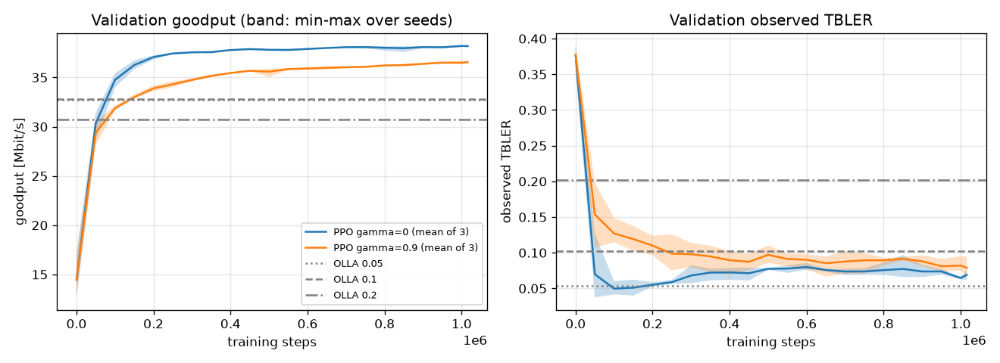
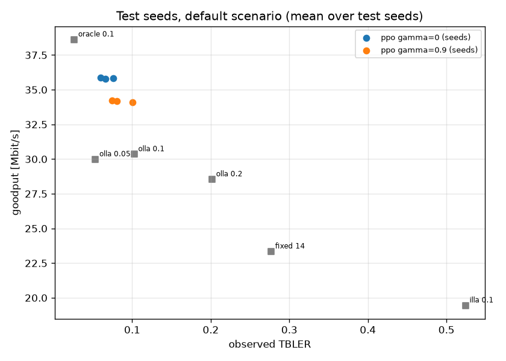
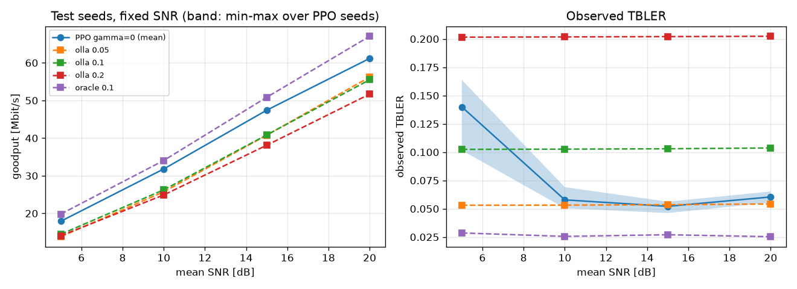

# M3: PPO on LinkAdaptation-v0

PPO (Stable-Baselines3) trained on `linkgym/LinkAdaptation-v0` and compared with Sionna's
OLLA and the other baselines on held-out seeds.

**Headline.** On the test seeds (1000-1009, 5 episodes each, default scenario), PPO with
gamma = 0, the configuration selected on the validation seeds, delivers
**+5.47 Mbit/s (+18.0%)** more goodput per episode than OLLA with TBLER target 0.1, the
OLLA target selected on the validation seeds. The 95% bootstrap CI is [+5.18, +5.75] Mbit/s,
[+16.8%, +19.4%]. Its observed TBLER is 0.035 lower [-0.041, -0.028]. The oracle, which sees
the channel of the slot being decided, is 2.80 Mbit/s above PPO. All of this holds for one
scenario of a simulator with the limitations listed below.

## Setup

- **Environment**: default `LinkAdaptation-v0` scenario. 1000-slot episodes, mean SNR drawn
  per episode from U(5, 20) dB, 15 m/s, feedback delay 1 slot, TDL-A with 100 ns delay
  spread at 3.5 GHz, 52 PRB at 30 kHz, PDSCH MCS table 1 (MCS 3-28), K = 4 reports in the
  observation. See [../../environment.md](../../environment.md).
- **PPO**: SB3 2.9.0 `PPO("MlpPolicy")`, `net_arch` 64x64 for policy and value networks,
  all other hyperparameters at SB3 defaults: learning rate 3e-4, `n_steps` 2048,
  `batch_size` 64, `n_epochs` 10, `gae_lambda` 0.95, clip range 0.2, `ent_coef` 0,
  `vf_coef` 0.5, `max_grad_norm` 0.5. gamma in {0, 0.9}. 8 `SubprocVecEnv` workers, one
  torch thread each. SB3 trains in whole rollouts of 8 x 2048 = 16,384 steps, so a run of
  1M steps is 62 rollouts = 1,015,808 steps.
- **No hyperparameter changes.** A 100k-step smoke test (gamma 0.9) improved validation
  goodput at every evaluation, so nothing was tuned.
- **Baselines**: OLLA with TBLER targets 0.05, 0.1 and 0.2, fed the wideband SINR report
  and the ACK of the previous slot, with Sionna defaults (`delta_up` 1 dB). ILLA 0.1
  without outer loop, fed only the wideband SINR report. Fixed MCS 14. The oracle is ILLA
  0.1 on the per-RE SINR of the slot being decided.
- **Code**: every `run.json` records commit `ce7619f` with `dirty: false`.

| seeds | use |
|---|---|
| training seed s in {0, 1, 2}, env i: s x 8 + i (0-23) | training |
| 500-509, 1 episode each | validation: learning curves and all selections |
| 1000-1009, 5 episodes each | test: final numbers only, never used for any selection |

## Budget

AMD Ryzen 7 7700X (8 cores, 16 threads), Windows 11, CPU only.

| run | wall time | validation part | steps/s | steps/s without validation |
|---|---:|---:|---:|---:|
| gamma=0 seed=0 | 656 s | 227 s | 1548 | 2369 |
| gamma=0 seed=1 | 654 s | 227 s | 1553 | 2377 |
| gamma=0 seed=2 | 654 s | 227 s | 1554 | 2380 |
| gamma=0.9 seed=0 | 655 s | 228 s | 1550 | 2377 |
| gamma=0.9 seed=1 | 656 s | 228 s | 1550 | 2373 |
| gamma=0.9 seed=2 | 657 s | 228 s | 1547 | 2370 |

The six runs took 66.6 minutes in total, run one after another; each run's process took
664-667 s including worker start-up and saving. The evaluation (43 jobs, about 2M
environment steps) took 468 s on 8 worker processes. It was run twice: the second run only
changed how the goodput-vs-TBLER figure labels the PPO models, and it reproduced every CSV
byte for byte.

## Protocol

1. **Selection on validation seeds only.** gamma is chosen by the final validation goodput
   of each run, as a mean over the 3 training seeds. The OLLA target is chosen by the mean
   goodput of OLLA 0.05, 0.1 and 0.2 on the same validation seeds. The test seeds were
   used for nothing else.
2. **Test.** Every policy runs the same 50 test episodes. With the same seed and episode
   index, all policies face the same SNR, channel and ACK draws; the script checks that
   the episodes match.
3. **Paired comparison.** For each PPO model, and for each gamma averaged over its 3
   training seeds per episode, the per-episode difference to each OLLA target. Reported as
   the mean difference with a 95% percentile bootstrap CI (10,000 resamples of the 50
   paired episodes, bootstrap seed 2026). The percentage is the ratio of means,
   100 x mean(difference) / mean(OLLA goodput).

The CIs describe the variability across test episodes for the given trained models. The
variability across training seeds is reported separately (std across the 3 seeds).

## Results

### Validation and selection

Seeds 500-509, 1 episode each. PPO rows: final validation goodput, mean ± std across the
3 training seeds. OLLA rows: mean ± std across the validation seeds.

| policy | goodput Mbit/s | observed TBLER | selected |
|---|---:|---:|:---:|
| ppo gamma=0 (3 seeds) | 38.18 ± 0.05 | 0.0689 | yes |
| ppo gamma=0.9 (3 seeds) | 36.55 ± 0.13 | 0.0788 | |
| olla 0.05 | 32.70 ± 14.62 | 0.0533 | |
| olla 0.1 | 32.83 ± 14.17 | 0.1026 | yes |
| olla 0.2 | 30.74 ± 12.88 | 0.2017 | |

OLLA 0.1 was selected over OLLA 0.05 by 0.13 Mbit/s, a close call.

### Test, default scenario

PPO config rows: mean ± std across the 3 training seeds. All other rows: mean ± std
across the 10 test seeds.

| policy | goodput Mbit/s | observed TBLER | mean MCS |
|---|---:|---:|---:|
| ppo gamma=0 (3 seeds) | 35.82 ± 0.04 | 0.0673 ± 0.0084 | 15.64 ± 0.08 |
| ppo gamma=0.9 (3 seeds) | 34.16 ± 0.05 | 0.0850 ± 0.0137 | 15.26 ± 0.20 |
| ppo gamma=0 seed=0 | 35.86 ± 4.44 | 0.0596 ± 0.0081 | 15.59 ± 1.60 |
| ppo gamma=0 seed=1 | 35.81 ± 4.46 | 0.0762 ± 0.0164 | 15.73 ± 1.53 |
| ppo gamma=0 seed=2 | 35.78 ± 4.42 | 0.0660 ± 0.0160 | 15.59 ± 1.52 |
| ppo gamma=0.9 seed=0 | 34.21 ± 4.52 | 0.0740 ± 0.0357 | 15.11 ± 1.41 |
| ppo gamma=0.9 seed=1 | 34.11 ± 4.54 | 0.1003 ± 0.0312 | 15.49 ± 1.41 |
| ppo gamma=0.9 seed=2 | 34.16 ± 4.39 | 0.0806 ± 0.0239 | 15.19 ± 1.44 |
| olla 0.05 | 29.98 ± 4.06 | 0.0531 ± 0.0005 | 13.53 ± 1.62 |
| olla 0.1 | 30.35 ± 3.97 | 0.1025 ± 0.0004 | 14.38 ± 1.62 |
| olla 0.2 | 28.54 ± 3.67 | 0.2017 ± 0.0005 | 15.32 ± 1.64 |
| illa 0.1 | 19.45 ± 2.11 | 0.5243 ± 0.0150 | 17.58 ± 1.74 |
| fixed 14 | 23.34 ± 4.15 | 0.2768 ± 0.1287 | 14.00 ± 0.00 |
| oracle 0.1 | 38.62 ± 4.86 | 0.0262 ± 0.0020 | 16.21 ± 1.67 |

### Paired differences vs OLLA

Mean difference PPO - OLLA over the 50 test episodes [95% bootstrap CI]. `*` marks the
OLLA target selected on validation.

| policy | vs | goodput diff Mbit/s | goodput diff % | TBLER diff |
|---|---|---:|---:|---:|
| ppo gamma=0 (mean of 3 seeds) | olla 0.05 | +5.83 [+5.56, +6.10] | +19.5 [+17.7, +21.4] | +0.0141 [+0.0084, +0.0210] |
| **ppo gamma=0 (mean of 3 seeds)** | **olla 0.1*** | **+5.47 [+5.18, +5.75]** | **+18.0 [+16.8, +19.4]** | **-0.0353 [-0.0410, -0.0283]** |
| ppo gamma=0 (mean of 3 seeds) | olla 0.2 | +7.28 [+6.74, +7.79] | +25.5 [+24.5, +26.6] | -0.1344 [-0.1402, -0.1275] |
| ppo gamma=0.9 (mean of 3 seeds) | olla 0.05 | +4.17 [+3.87, +4.45] | +13.9 [+12.5, +15.4] | +0.0318 [+0.0178, +0.0480] |
| ppo gamma=0.9 (mean of 3 seeds) | olla 0.1* | +3.81 [+3.51, +4.10] | +12.6 [+11.6, +13.5] | -0.0176 [-0.0316, -0.0014] |
| ppo gamma=0.9 (mean of 3 seeds) | olla 0.2 | +5.62 [+5.09, +6.13] | +19.7 [+18.8, +20.5] | -0.1167 [-0.1307, -0.1005] |
| ppo gamma=0 seed=0 | olla 0.05 | +5.88 [+5.61, +6.13] | +19.6 [+17.8, +21.6] | +0.0064 [+0.0029, +0.0104] |
| ppo gamma=0 seed=0 | olla 0.1* | +5.51 [+5.23, +5.78] | +18.2 [+16.9, +19.6] | -0.0430 [-0.0465, -0.0391] |
| ppo gamma=0 seed=0 | olla 0.2 | +7.32 [+6.80, +7.82] | +25.6 [+24.6, +26.8] | -0.1421 [-0.1456, -0.1382] |
| ppo gamma=0 seed=1 | olla 0.05 | +5.83 [+5.54, +6.10] | +19.4 [+17.7, +21.3] | +0.0230 [+0.0155, +0.0320] |
| ppo gamma=0 seed=1 | olla 0.1* | +5.46 [+5.16, +5.75] | +18.0 [+16.8, +19.3] | -0.0264 [-0.0339, -0.0174] |
| ppo gamma=0 seed=1 | olla 0.2 | +7.27 [+6.73, +7.80] | +25.5 [+24.5, +26.5] | -0.1255 [-0.1330, -0.1165] |
| ppo gamma=0 seed=2 | olla 0.05 | +5.80 [+5.51, +6.06] | +19.3 [+17.6, +21.3] | +0.0129 [+0.0058, +0.0212] |
| ppo gamma=0 seed=2 | olla 0.1* | +5.43 [+5.14, +5.72] | +17.9 [+16.6, +19.3] | -0.0365 [-0.0435, -0.0282] |
| ppo gamma=0 seed=2 | olla 0.2 | +7.24 [+6.71, +7.76] | +25.4 [+24.3, +26.4] | -0.1356 [-0.1427, -0.1273] |
| ppo gamma=0.9 seed=0 | olla 0.05 | +4.23 [+3.92, +4.49] | +14.1 [+12.7, +15.6] | +0.0209 [+0.0054, +0.0392] |
| ppo gamma=0.9 seed=0 | olla 0.1* | +3.86 [+3.56, +4.13] | +12.7 [+11.7, +13.8] | -0.0285 [-0.0440, -0.0103] |
| ppo gamma=0.9 seed=0 | olla 0.2 | +5.67 [+5.15, +6.15] | +19.9 [+19.0, +20.7] | -0.1277 [-0.1431, -0.1094] |
| ppo gamma=0.9 seed=1 | olla 0.05 | +4.12 [+3.79, +4.44] | +13.7 [+12.3, +15.2] | +0.0472 [+0.0317, +0.0643] |
| ppo gamma=0.9 seed=1 | olla 0.1* | +3.76 [+3.42, +4.08] | +12.4 [+11.4, +13.3] | -0.0022 [-0.0177, +0.0149] |
| ppo gamma=0.9 seed=1 | olla 0.2 | +5.57 [+5.00, +6.11] | +19.5 [+18.6, +20.4] | -0.1014 [-0.1168, -0.0842] |
| ppo gamma=0.9 seed=2 | olla 0.05 | +4.18 [+3.90, +4.44] | +13.9 [+12.5, +15.4] | +0.0275 [+0.0154, +0.0410] |
| ppo gamma=0.9 seed=2 | olla 0.1* | +3.81 [+3.53, +4.08] | +12.6 [+11.6, +13.5] | -0.0219 [-0.0340, -0.0083] |
| ppo gamma=0.9 seed=2 | olla 0.2 | +5.62 [+5.11, +6.12] | +19.7 [+18.8, +20.5] | -0.1211 [-0.1331, -0.1075] |

### Fixed SNR

Test seeds, snr_db fixed per scenario. Mean goodput Mbit/s / observed TBLER over the 10
test seeds. PPO: the 3 models of the selected gamma = 0.

| policy | 5 dB | 10 dB | 15 dB | 20 dB |
|---|---:|---:|---:|---:|
| olla 0.05 | 13.80 / 0.053 | 25.73 / 0.053 | 40.77 / 0.054 | 56.21 / 0.054 |
| olla 0.1 | 14.46 / 0.102 | 26.26 / 0.103 | 40.84 / 0.103 | 55.50 / 0.104 |
| olla 0.2 | 14.06 / 0.202 | 24.90 / 0.202 | 38.10 / 0.202 | 51.68 / 0.202 |
| oracle 0.1 | 19.82 / 0.029 | 34.06 / 0.026 | 50.84 / 0.027 | 67.05 / 0.025 |
| ppo gamma=0 seed=0 | 18.04 / 0.102 | 31.88 / 0.050 | 47.42 / 0.056 | 61.04 / 0.065 |
| ppo gamma=0 seed=1 | 17.84 / 0.164 | 31.75 / 0.069 | 47.39 / 0.054 | 61.39 / 0.055 |
| ppo gamma=0 seed=2 | 17.86 / 0.155 | 31.77 / 0.054 | 47.42 / 0.046 | 61.08 / 0.061 |

### Figures



Validation goodput and TBLER during training. Mean of the 3 training seeds per gamma,
band = min-max over the seeds; horizontal lines are OLLA on the same validation seeds.



Test seeds, default scenario, one point per policy (PPO: one point per trained model).



Fixed-SNR grid on the test seeds; band = min-max over the 3 PPO models.

## Interpretation

- **PPO vs OLLA.** In this scenario PPO with gamma = 0 has a higher goodput than OLLA at
  all three TBLER targets, for each of its 3 training seeds, and at every SNR of the
  fixed-SNR grid. The spread across training seeds is small: 0.04 Mbit/s std on the test
  seeds.
- **Higher MCS at lower TBLER.** PPO transmits at a higher mean MCS than OLLA 0.1 (15.64 vs
  14.38) and still has a lower TBLER (0.067 vs 0.103). Its MCS choices match the channel of
  the slot better than OLLA's. This experiment does not isolate where that comes from.
  Candidate explanations, none of them tested here:
  - PPO sees the last 4 reports and can use the SINR trend; at 15 m/s the channel changes
    noticeably from one 0.5 ms slot to the next. OLLA uses only the latest report.
  - OLLA corrects the gap between the reported wideband SINR and the effective SINR that
    decides the ACK with a single additive offset, while that gap depends on the MCS and
    on the channel. PPO learns a non-linear mapping.
  - PPO maximizes goodput directly, while OLLA holds a TBLER target. The three targets
    tried do not close the gap.
- **gamma.** gamma = 0 learned faster and ended higher than gamma = 0.9, on validation
  and on test. Actions do not change the channel or the ACK draws; they only change which
  MCS and ACK appear in later observations. The problem is therefore close to a
  contextual bandit, and within 1M steps the longer horizon did not help.
- **Oracle.** PPO closes about two thirds of the gap between OLLA 0.1 and the oracle
  (5.47 of 8.27 Mbit/s).
- **Low SNR.** At 5 dB, the lower edge of the training range, PPO's TBLER rises to
  0.10-0.16, while its goodput stays 3.4-3.6 Mbit/s above OLLA 0.1.

## Limitations

- **One scenario.** One TDL profile, speed, delay spread and feedback delay, and a single
  SISO link. The results say nothing about other scenarios; PPO was trained and tested on
  the same scenario distribution.
- **Simulator.** Link-level abstraction with the limits in
  [../../benchmarks.md](../../benchmarks.md#known-limitations): coarse BLER tables with
  interpolated waterfalls, no HARQ retransmissions, no interference, no channel
  estimation error, flat mean SNR. A learned policy adapts to this abstraction,
  including its artifacts, which a real link does not have.
- **Baselines as configured.** OLLA and ILLA get the wideband mean SINR as their SINR
  report, as defined by the environment, and run with Sionna's default OLLA step
  (`delta_up` 1 dB) and initial values. OLLA with a different report (e.g. CQI- or
  EESM-based) or a tuned step size was not evaluated.
- **PPO budget.** SB3 default hyperparameters, 1M steps, 3 training seeds, gamma in
  {0, 0.9}; no tuning.
- **Statistics.** 50 test episodes. The bootstrap CIs cover the variability across test
  episodes for the trained models; the training-seed variability is only the std of 3
  seeds.

## Reproduce

```bash
python examples/train_ppo.py --gamma 0 --seed 0      # and seeds 1, 2; gamma 0.9
python examples/evaluate_all.py
```

`train_ppo.py` writes `runs/m3/gamma<g>_seed<s>/` (model, `run.json`, `eval_log.csv`,
TensorBoard logs); `evaluate_all.py` writes per-episode CSVs to `results/m3/` and the
tables (`validation.csv`, `summary.csv`, `paired.csv`, `fixed_snr.csv`,
`learning_curves.csv`) and figures in this directory. Neither `runs/` nor `results/` is
committed.
