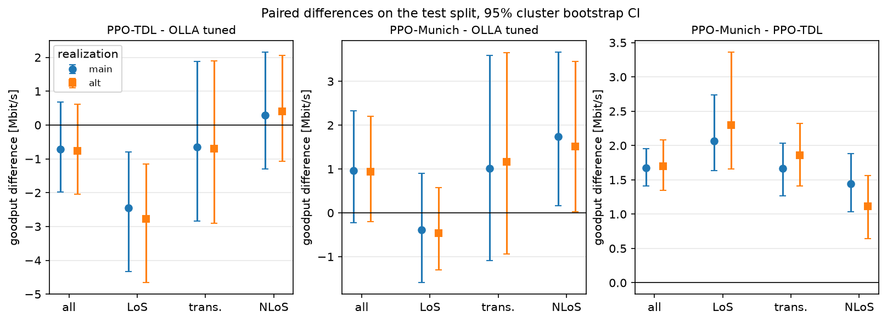
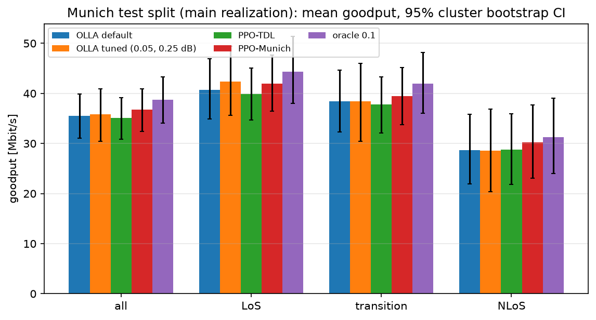
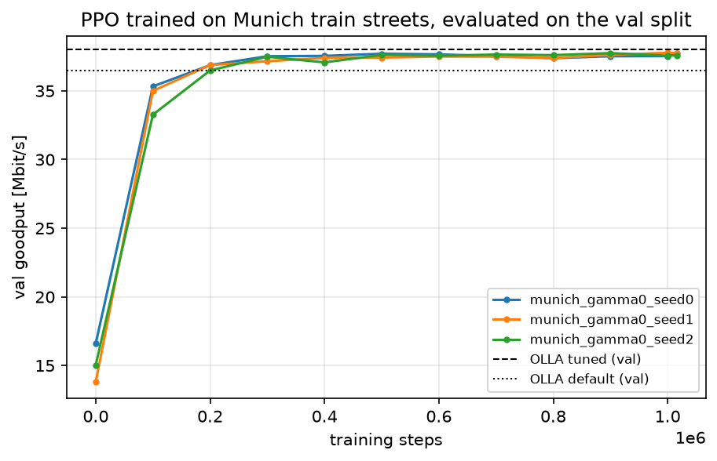

# v0.2: link adaptation on ray-traced Munich streets

PPO and Sionna's OLLA on the Munich trace dataset, following the protocol fixed in
advance in [PROTOCOL.md](PROTOCOL.md) (commit `8daae50`, before any training or
evaluation on val or test). The test split was evaluated once, on both ray-tracing
realizations. All differences are paired (same episodes, same SNR, same channel, same ACK
draws) with 95% cluster bootstrap CIs over trajectories.

## Answers

- **Q1. PPO trained on TDL, on Munich.** No detectable difference from tuned OLLA overall:
  -0.71 Mbit/s (-2.0%), CI [-1.99, +0.69] Mbit/s. On the line-of-sight street it is worse
  (-2.45 Mbit/s, CI [-4.33, -0.79]), in both realizations. Its +16% advantage over tuned
  OLLA on the TDL channel (M3, reproduced in Q4) does not carry over to these streets.
- **Q2. PPO trained on the Munich train streets.** Against tuned OLLA: +0.96 Mbit/s
  (+2.7%), CI [-0.22, +2.32] Mbit/s, so no detectable difference overall, with a lower
  observed TBLER (-0.016, CI [-0.024, -0.008]). On the NLoS streets it is better (+1.73
  Mbit/s, CI [+0.16, +3.66]). Against PPO trained on TDL: **+1.67 Mbit/s (+4.8%), CI
  [+1.41, +1.96]**, better overall and in every category. Training on the site helps
  relative to training on TDL; whether it beats a well-tuned OLLA is not established on
  these four test streets.
- **Q3. Robustness.** For every comparison and category, the classification (better,
  worse, no detectable difference) is the same in both realizations; none is contradicted. PPO-Munich - PPO-TDL *holds* overall and in all three categories;
  PPO-TDL - tuned OLLA *holds* (negative) on the line-of-sight street; PPO-Munich - tuned
  OLLA *holds* (positive) on the NLoS streets; everything else is *inconclusive*.
- **Q4. PPO trained on Munich, on TDL.** It is 2.56 Mbit/s (-8.3%) below the M3 tuned OLLA
  on the TDL test seeds, with an observed TBLER of 0.25: its MCS choices are too
  aggressive for the TDL channel. Each PPO does best on the kind of channel it was trained
  on.

## Primary comparisons

Goodput difference per 1000-slot episode (Mbit/s, and % of the reference), test split, 92
episodes on 23 trajectories. Tuned OLLA is the val-selected cell, TBLER target 0.05 with
`delta_up` 0.25 dB. PPO-TDL and PPO-Munich are the per-episode means of three training
seeds.

| comparison | main realization | alternative realization | verdict |
|---|---|---|---|
| Q1: PPO-TDL - tuned OLLA | -0.71 [-1.99, +0.69] (-2.0% [-4.9, +2.2]) | -0.77 [-2.05, +0.62] (-2.1% [-5.1, +1.9]) | inconclusive |
| Q2: PPO-Munich - tuned OLLA | +0.96 [-0.22, +2.32] (+2.7% [-0.6, +7.4]) | +0.93 [-0.20, +2.21] (+2.6% [-0.5, +6.9]) | inconclusive |
| Q2: PPO-Munich - PPO-TDL | +1.67 [+1.41, +1.96] (+4.8% [+4.0, +5.5]) | +1.70 [+1.34, +2.08] (+4.7% [+3.8, +5.8]) | holds |

**The CIs do not include training-seed variance**: they describe the test episodes for
the trained models. Per seed, PPO-Munich - tuned OLLA is +0.98, +1.25 and +0.65 Mbit/s
(only seed 1's CI, [+0.11, +2.59], excludes zero); PPO-TDL - tuned OLLA is -0.65, -0.66 and
-0.82 Mbit/s (none excludes zero). See [paired.csv](paired.csv).

## By route category

| comparison | category (streets, trajectories) | main | alternative | verdict |
|---|---|---|---|---|
| PPO-TDL - tuned OLLA | LoS (1, 5) | -2.45 [-4.33, -0.79] | -2.77 [-4.66, -1.15] | holds |
| | transition (1, 10) | -0.65 [-2.85, +1.88] | -0.69 [-2.91, +1.90] | inconclusive |
| | NLoS (2, 8) | +0.29 [-1.31, +2.15] | +0.40 [-1.08, +2.06] | inconclusive |
| PPO-Munich - tuned OLLA | LoS | -0.39 [-1.59, +0.90] | -0.47 [-1.30, +0.57] | inconclusive |
| | transition | +1.02 [-1.09, +3.59] | +1.17 [-0.94, +3.65] | inconclusive |
| | NLoS | +1.73 [+0.16, +3.66] | +1.52 [+0.03, +3.45] | holds |
| PPO-Munich - PPO-TDL | LoS | +2.07 [+1.64, +2.74] | +2.30 [+1.66, +3.36] | holds |
| | transition | +1.66 [+1.27, +2.03] | +1.86 [+1.41, +2.32] | holds |
| | NLoS | +1.44 [+1.04, +1.88] | +1.12 [+0.64, +1.56] | holds |

## All policies

Test split, main realization (alternative realization in [test_summary.csv](test_summary.csv)):

| policy | goodput [Mbit/s] | vs tuned OLLA | observed TBLER | mean MCS |
|---|---:|---|---:|---:|
| fixed MCS 14 | 21.79 | -14.03 [-17.46, -10.78] | 0.325 | 14.00 |
| ILLA 0.1 | 30.64 | -5.18 [-8.36, -2.08] | 0.320 | 16.45 |
| default OLLA (0.1, 1 dB) | 35.52 | -0.30 [-1.34, +0.89] | 0.172 | 15.70 |
| tuned OLLA (0.05, 0.25 dB) | 35.82 | | 0.129 | 15.02 |
| PPO-TDL (3 seeds) | 35.11 | -0.71 [-1.99, +0.69] | 0.125 | 14.95 |
| PPO-Munich (3 seeds) | 36.78 | +0.96 [-0.22, +2.32] | 0.113 | 15.26 |
| oracle 0.1 | 38.77 | +2.95 [+1.86, +4.20] | 0.110 | 15.86 |

The oracle, which sees the channel of the slot being decided, is 2.95 Mbit/s above tuned
OLLA; PPO-Munich closes about a third of that gap. Tuning OLLA matters little here (default
vs tuned: -0.30 Mbit/s, CI including zero), although it lowers the TBLER.

The intervals in this figure are for absolute means and are wide because the trajectories
differ a lot (street, SNR draw); the paired comparisons above remove that variation.

## Per route

Main realization, goodput and difference against tuned OLLA (CI over the route's
trajectories; none for `south-curve`, which has one):

| route | category | trajectories | tuned OLLA | PPO-TDL | PPO-Munich | oracle |
|---|---|---:|---:|---|---|---|
| south-street | LoS | 5 | 42.34 | -2.45 [-4.33, -0.79] | -0.39 [-1.59, +0.90] | +2.00 [+1.17, +2.96] |
| west-street | transition | 10 | 38.40 | -0.65 [-2.85, +1.88] | +1.02 [-1.09, +3.59] | +3.55 [+1.64, +6.17] |
| long-diagonal | NLoS | 7 | 30.62 | +0.38 [-1.40, +2.48] | +1.88 [+0.09, +4.09] | +2.99 [+1.25, +5.10] |
| south-curve | NLoS | 1 | 13.84 | -0.34 | +0.69 | +1.40 |

With four test routes, one or two per category, this table describes these streets; it is
weak evidence about routes in general.

## Q4: on the TDL channel

M3 test seeds 1000-1009, 5 episodes each, default TDL scenario, paired per-episode
bootstrap against the M3 tuned OLLA cell (0.1, 0.25 dB):

| policy | goodput [Mbit/s] | vs M3 tuned OLLA | observed TBLER |
|---|---:|---|---:|
| M3 tuned OLLA (0.1, 0.25 dB) | 30.89 | | 0.110 |
| PPO-TDL (3 seeds) | 35.82 | +4.93 [+4.65, +5.20] (+16.0%) | 0.067 |
| PPO-Munich (3 seeds) | 28.33 | -2.56 [-2.87, -2.26] (-8.3%) | 0.247 |

PPO-TDL reproduces the M3 result exactly. PPO-Munich chooses about the same mean MCS as
PPO-TDL (15.7 against 15.6) but loses a quarter of its transport blocks on TDL; why its
choices fit the ray-traced channels and not TDL was not investigated.

## Validation

Val split, 56 episodes (14 trajectories). The OLLA grid
([olla_tuning.csv](olla_tuning.csv)) favours the lowest TBLER target: 0.05 beats 0.1 by
about 1.2 Mbit/s and 0.2 by about 4.7 Mbit/s; the step size matters little. Selected:
target 0.05, `delta_up` 0.25 dB (38.02 Mbit/s). On val, PPO-Munich reached 37.68 Mbit/s
(seeds 37.71, 37.76, 37.58), slightly below tuned OLLA, PPO-TDL 36.18 and the oracle 39.48
([validation.csv](validation.csv)). Nothing was selected on val besides the OLLA cell.

The learning curves rise to about 37.5 Mbit/s within 300k steps and stay flat; the three
seeds agree within 0.3 Mbit/s.

## Interpretation and limitations

- **Site-specific training helps against generic training.** The +1.7 Mbit/s of
  PPO-Munich over PPO-TDL is consistent across categories, seeds and both realizations.
  Q4 shows the converse on TDL: the policies specialize to the channel statistics they were
  trained on.
- **Against a tuned OLLA, PPO's advantage is small or absent here.** On TDL (M3), PPO
  beat tuned OLLA by 16%; on these streets PPO-TDL is level with it and PPO-Munich is ahead
  by an amount whose CI includes zero (better only on the NLoS streets). Tuned OLLA is
  within 3 Mbit/s of the oracle on Munich, which leaves less room than on TDL.
- **Few streets.** The test split has four streets: one line-of-sight street (5
  trajectories), one transition street (10) and two NLoS streets (7 and 1). The cluster
  bootstrap resamples trajectories within them, so the results describe these streets,
  not routes or sites in general. One site, one base station, one scene.
- **Training-seed variance is not in the CIs** (three seeds per PPO family; per-seed
  results above and in [paired.csv](paired.csv)).
- **Ray-tracing non-convergence.** The dataset is one deterministic realization (see
  [docs/channels.md](../../channels.md#known-limitations-of-the-munich-traces)). All
  verdicts were the same on the alternative realization (more rays, smaller path buffer),
  which is one other ray budget, not an independent channel.
- **Normalized SNR only**: the absolute level along a street is removed per trajectory;
  the SNR is drawn per episode as in v0.1.
- **OLLA misses its target.** The selected OLLA (target 0.05) reaches an observed TBLER of
  0.13 on test (0.15 on val). The reason was not investigated (candidates: the step size
  against the level changes along a street, the BLER-table limits); a finer OLLA grid was
  not part of the protocol.
- **Secondary comparisons are uncorrected** for multiple testing.

## Setup and budget

| item | value |
|---|---|
| data | `data/munich-v1.h5` (`4b3bbb24...`), `data/munich-v1-test-alt.h5` (`0969ea36...`); checked by the scripts |
| code | commit `8daae50`, recorded clean by every training run |
| PPO-Munich training | 1201, 1170 and 1169 s per run (2227-2278 steps/s without validation; 12 val passes of about 60 s each) |
| evaluation | validation 347 s, test 583 s, Q4 103 s, with 8 worker processes |

Ryzen 7 7700X, Windows 11, CPU only. Training and evaluation ran as in the protocol, with
no deviations.

## Files

- [PROTOCOL.md](PROTOCOL.md): the protocol, fixed before the experiment.
- [paired.csv](paired.csv): every comparison against tuned OLLA and PPO-Munich - PPO-TDL,
  per realization and category, goodput and TBLER differences with CIs.
- [robustness.csv](robustness.csv): the primary comparisons on both realizations, with the
  verdicts.
- [test_summary.csv](test_summary.csv), [per_route.csv](per_route.csv): means per policy,
  realization, category and route.
- [validation.csv](validation.csv), [olla_tuning.csv](olla_tuning.csv),
  [learning_curves.csv](learning_curves.csv), [q4.csv](q4.csv).
- Figures: [realizations.png](realizations.png),
  [goodput_by_category.png](goodput_by_category.png),
  [learning_curves.png](learning_curves.png).

Per-episode results are in `results/v02/` (not committed); `examples/evaluate_v02.py
report` rebuilds these tables and figures from them.
