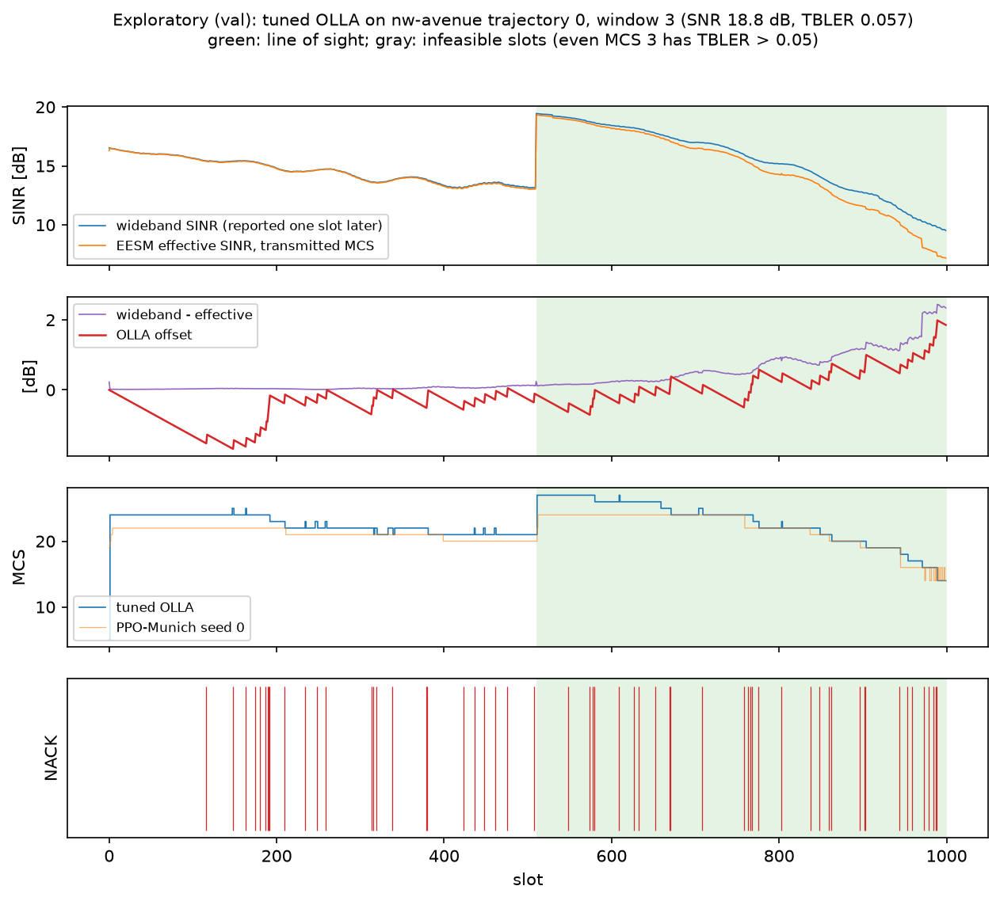
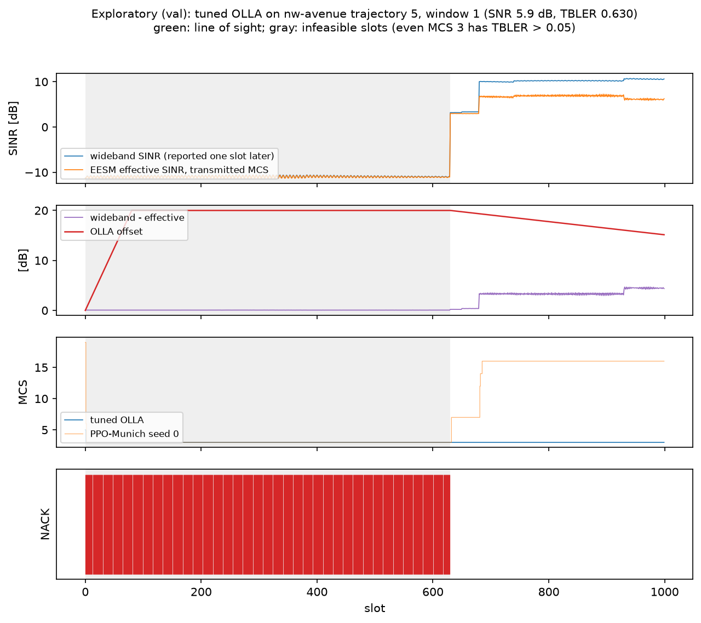

# v0.2: link adaptation on ray-traced Munich streets

PPO and Sionna's OLLA on the Munich trace dataset, following the protocol fixed in
advance in [PROTOCOL.md](PROTOCOL.md) (commit `8daae50`, before any training or
evaluation on val or test). The test split was evaluated once, on both ray-tracing
realizations. All differences are paired (same episodes, same SNR, same channel, same ACK
draws) with 95% cluster bootstrap CIs over trajectories.

## Answers

- **Q1. PPO trained on TDL, on Munich.** No detectable difference from tuned OLLA overall:
  -0.71 Mbit/s (-2.0%), CI [-1.99, +0.69] Mbit/s. On the line-of-sight street it is worse
  (-2.45 Mbit/s, CI [-4.33, -0.79]), in both realizations. Its +16% advantage over tuned
  OLLA on the TDL channel (M3, reproduced in Q4) does not carry over to these streets.
- **Q2. PPO trained on the Munich train streets.** Against tuned OLLA: +0.96 Mbit/s
  (+2.7%), CI [-0.22, +2.32] Mbit/s, so no detectable difference overall, with a lower
  observed TBLER (-0.016, CI [-0.024, -0.008]). On the NLoS streets it is better (+1.73
  Mbit/s, CI [+0.16, +3.66]). Against PPO trained on TDL: **+1.67 Mbit/s (+4.8%), CI
  [+1.41, +1.96]**, better overall and in every category. Training on the site helps
  relative to training on TDL; whether it beats a well-tuned OLLA is not established on
  these four test streets.
- **Q3. Robustness.** For every comparison and category, the classification (better,
  worse, no detectable difference) is the same in both realizations; none is contradicted. PPO-Munich - PPO-TDL *holds* overall and in all three categories;
  PPO-TDL - tuned OLLA *holds* (negative) on the line-of-sight street; PPO-Munich - tuned
  OLLA *holds* (positive) on the NLoS streets; everything else is *inconclusive*.
- **Q4. PPO trained on Munich, on TDL.** It is 2.56 Mbit/s (-8.3%) below the M3 tuned OLLA
  on the TDL test seeds, with an observed TBLER of 0.25: its MCS choices are too
  aggressive for the TDL channel. Each PPO does best on the kind of channel it was trained
  on.

## Primary comparisons

Goodput difference per 1000-slot episode (Mbit/s, and % of the reference), test split, 92
episodes on 23 trajectories. Tuned OLLA is the val-selected cell, TBLER target 0.05 with
`delta_up` 0.25 dB. PPO-TDL and PPO-Munich are the per-episode means of three training
seeds.

| comparison | main realization | alternative realization | verdict |
|---|---|---|---|
| Q1: PPO-TDL - tuned OLLA | -0.71 [-1.99, +0.69] (-2.0% [-4.9, +2.2]) | -0.77 [-2.05, +0.62] (-2.1% [-5.1, +1.9]) | inconclusive |
| Q2: PPO-Munich - tuned OLLA | +0.96 [-0.22, +2.32] (+2.7% [-0.6, +7.4]) | +0.93 [-0.20, +2.21] (+2.6% [-0.5, +6.9]) | inconclusive |
| Q2: PPO-Munich - PPO-TDL | +1.67 [+1.41, +1.96] (+4.8% [+4.0, +5.5]) | +1.70 [+1.34, +2.08] (+4.7% [+3.8, +5.8]) | holds |

**The CIs do not include training-seed variance**: they describe the test episodes for
the trained models. Per seed, PPO-Munich - tuned OLLA is +0.98, +1.25 and +0.65 Mbit/s
(only seed 1's CI, [+0.11, +2.59], excludes zero); PPO-TDL - tuned OLLA is -0.65, -0.66 and
-0.82 Mbit/s (none excludes zero). See [paired.csv](paired.csv).

## By route category

| comparison | category (streets, trajectories) | main | alternative | verdict |
|---|---|---|---|---|
| PPO-TDL - tuned OLLA | LoS (1, 5) | -2.45 [-4.33, -0.79] | -2.77 [-4.66, -1.15] | holds |
| | transition (1, 10) | -0.65 [-2.85, +1.88] | -0.69 [-2.91, +1.90] | inconclusive |
| | NLoS (2, 8) | +0.29 [-1.31, +2.15] | +0.40 [-1.08, +2.06] | inconclusive |
| PPO-Munich - tuned OLLA | LoS | -0.39 [-1.59, +0.90] | -0.47 [-1.30, +0.57] | inconclusive |
| | transition | +1.02 [-1.09, +3.59] | +1.17 [-0.94, +3.65] | inconclusive |
| | NLoS | +1.73 [+0.16, +3.66] | +1.52 [+0.03, +3.45] | holds |
| PPO-Munich - PPO-TDL | LoS | +2.07 [+1.64, +2.74] | +2.30 [+1.66, +3.36] | holds |
| | transition | +1.66 [+1.27, +2.03] | +1.86 [+1.41, +2.32] | holds |
| | NLoS | +1.44 [+1.04, +1.88] | +1.12 [+0.64, +1.56] | holds |

## All policies

Test split, main realization (alternative realization in [test_summary.csv](test_summary.csv)):

| policy | goodput [Mbit/s] | vs tuned OLLA | observed TBLER | mean MCS |
|---|---:|---|---:|---:|
| fixed MCS 14 | 21.79 | -14.03 [-17.46, -10.78] | 0.325 | 14.00 |
| ILLA 0.1 | 30.64 | -5.18 [-8.36, -2.08] | 0.320 | 16.45 |
| default OLLA (0.1, 1 dB) | 35.52 | -0.30 [-1.34, +0.89] | 0.172 | 15.70 |
| tuned OLLA (0.05, 0.25 dB) | 35.82 | | 0.129 | 15.02 |
| PPO-TDL (3 seeds) | 35.11 | -0.71 [-1.99, +0.69] | 0.125 | 14.95 |
| PPO-Munich (3 seeds) | 36.78 | +0.96 [-0.22, +2.32] | 0.113 | 15.26 |
| oracle 0.1 | 38.77 | +2.95 [+1.86, +4.20] | 0.110 | 15.86 |

The oracle, which sees the channel of the slot being decided, is 2.95 Mbit/s above tuned
OLLA; PPO-Munich closes about a third of that gap. Tuning OLLA matters little here (default
vs tuned: -0.30 Mbit/s, CI including zero), although it lowers the TBLER.

The intervals in this figure are for absolute means and are wide because the trajectories
differ a lot (street, SNR draw); the paired comparisons above remove that variation.

## Per route

Main realization, goodput and difference against tuned OLLA (CI over the route's
trajectories; none for `south-curve`, which has one):

| route | category | trajectories | tuned OLLA | PPO-TDL | PPO-Munich | oracle |
|---|---|---:|---:|---|---|---|
| south-street | LoS | 5 | 42.34 | -2.45 [-4.33, -0.79] | -0.39 [-1.59, +0.90] | +2.00 [+1.17, +2.96] |
| west-street | transition | 10 | 38.40 | -0.65 [-2.85, +1.88] | +1.02 [-1.09, +3.59] | +3.55 [+1.64, +6.17] |
| long-diagonal | NLoS | 7 | 30.62 | +0.38 [-1.40, +2.48] | +1.88 [+0.09, +4.09] | +2.99 [+1.25, +5.10] |
| south-curve | NLoS | 1 | 13.84 | -0.34 | +0.69 | +1.40 |

With four test routes, one or two per category, this table describes these streets; it is
weak evidence about routes in general.

## Q4: on the TDL channel

M3 test seeds 1000-1009, 5 episodes each, default TDL scenario, paired per-episode
bootstrap against the M3 tuned OLLA cell (0.1, 0.25 dB):

| policy | goodput [Mbit/s] | vs M3 tuned OLLA | observed TBLER |
|---|---:|---|---:|
| M3 tuned OLLA (0.1, 0.25 dB) | 30.89 | | 0.110 |
| PPO-TDL (3 seeds) | 35.82 | +4.93 [+4.65, +5.20] (+16.0%) | 0.067 |
| PPO-Munich (3 seeds) | 28.33 | -2.56 [-2.87, -2.26] (-8.3%) | 0.247 |

PPO-TDL reproduces the M3 result exactly. PPO-Munich chooses about the same mean MCS as
PPO-TDL (15.7 against 15.6) but loses a quarter of its transport blocks on TDL; why its
choices fit the ray-traced channels and not TDL was not investigated.

## Validation

Val split, 56 episodes (14 trajectories). The OLLA grid
([olla_tuning.csv](olla_tuning.csv)) favours the lowest TBLER target: 0.05 beats 0.1 by
about 1.2 Mbit/s and 0.2 by about 4.7 Mbit/s; the step size matters little. Selected:
target 0.05, `delta_up` 0.25 dB (38.02 Mbit/s). On val, PPO-Munich reached 37.68 Mbit/s
(seeds 37.71, 37.76, 37.58), slightly below tuned OLLA, PPO-TDL 36.18 and the oracle 39.48
([validation.csv](validation.csv)). Nothing was selected on val besides the OLLA cell.

The learning curves rise to about 37.5 Mbit/s within 300k steps and stay flat; the three
seeds agree within 0.3 Mbit/s.

## Interpretation and limitations

- **Site-specific training helps against generic training.** The +1.7 Mbit/s of
  PPO-Munich over PPO-TDL is consistent across categories, seeds and both realizations.
  Q4 shows the converse on TDL: the policies specialize to the channel statistics they were
  trained on.
- **Against a tuned OLLA, PPO's advantage is small or absent here.** On TDL (M3), PPO
  beat tuned OLLA by 16%; on these streets PPO-TDL is level with it and PPO-Munich is ahead
  by an amount whose CI includes zero (better only on the NLoS streets). Tuned OLLA is
  within 3 Mbit/s of the oracle on Munich, which leaves less room than on TDL.
- **Few streets.** The test split has four streets: one line-of-sight street (5
  trajectories), one transition street (10) and two NLoS streets (7 and 1). The cluster
  bootstrap resamples trajectories within them, so the results describe these streets,
  not routes or sites in general. One site, one base station, one scene.
- **Training-seed variance is not in the CIs** (three seeds per PPO family; per-seed
  results above and in [paired.csv](paired.csv)).
- **Ray-tracing non-convergence.** The dataset is one deterministic realization (see
  [docs/channels.md](../../channels.md#known-limitations-of-the-munich-traces)). All
  verdicts were the same on the alternative realization (more rays, smaller path buffer),
  which is one other ray budget, not an independent channel.
- **Normalized SNR only**: the absolute level along a street is removed per trajectory;
  the SNR is drawn per episode as in v0.1.
- **OLLA misses its target.** The selected OLLA (target 0.05) reaches an observed TBLER of
  0.13 on test (0.15 on val). The reason was not investigated within the protocol
  (candidates: the step size against the level changes along a street, the BLER-table
  limits); a finer OLLA grid was not part of the protocol. A post hoc analysis on the val
  split follows in [Exploratory analysis](#exploratory-analysis-post-hoc-validation-split).
- **Secondary comparisons are uncorrected** for multiple testing.

## Exploratory analysis (post hoc, validation split)

> **Not part of the protocol.** This analysis was designed after the test results were
> known, to explain one of them. It uses only the val split, and the test split was not
> used again. Nothing in the sections above was changed. Script:
> [examples/olla_val_analysis.py](../../../examples/olla_val_analysis.py).

**Question.** On the Munich test split, the selected OLLA (target 0.05) has an observed
TBLER of 0.13 (0.15 on val). On TDL, OLLA met its targets. Why the difference?

**Method.**

- **Episodes**:
  - Munich: the protocol's 56 pinned val episodes (seeds 5000-5055, 14 trajectories).
  - TDL: the default scenario on the M3 val seeds 500-509.
- **Policies**:
  - Munich: tuned OLLA (0.05, 0.25 dB), PPO-Munich training seed 0 and fixed MCS 3.
  - TDL: OLLA with the same cell, the M3 tuned cell (0.1, 0.25 dB) and fixed MCS 3.
- **Recorded per slot**:
  - the MCS and the ACK;
  - OLLA's offset;
  - the wideband SINR, which the next slot's report carries;
  - the EESM effective SINR of the transmitted MCS.
- **Infeasible slot**: one where even MCS 3, the lowest MCS the environment offers, has a
  TBLER above 0.05. In such a slot no MCS choice can meet the target. Sionna 2.1 has no
  BLER tables for MCS 0-2, and whether those MCSs would serve some of these slots was not
  measured.

Observed TBLER by episode quarter (slots 0-249, ..., 750-999):

| scenario, policy | TBLER | q1 | q2 | q3 | q4 | infeasible slots | TBLER in feasible slots |
|---|---:|---:|---:|---:|---:|---:|---:|
| Munich, tuned OLLA (0.05, 0.25 dB) | 0.147 | 0.144 | 0.152 | 0.160 | 0.134 | 10.2% | 0.051 |
| Munich, PPO-Munich seed 0 | 0.129 | 0.120 | 0.136 | 0.143 | 0.117 | 10.2% | 0.030 |
| TDL, OLLA (0.05, 0.25 dB) | 0.063 | 0.104 | 0.047 | 0.052 | 0.050 | 0.08% | 0.063 |
| TDL, M3 tuned OLLA (0.1, 0.25 dB) | 0.110 | 0.144 | 0.096 | 0.100 | 0.101 | 0.08% | 0.110 |

By route category, Munich val:

| category (episodes) | infeasible slots | tuned OLLA | OLLA, feasible slots | PPO-Munich | PPO, feasible slots |
|---|---:|---:|---:|---:|---:|
| LoS (12) | 4.9% | 0.091 | 0.047 | 0.059 | 0.012 |
| transition (24) | 21.5% | 0.254 | 0.050 | 0.228 | 0.017 |
| NLoS (20) | 0% | 0.054 | 0.054 | 0.053 | 0.053 |

The quarters per category, and the feasible-slot TBLER per quarter, are in
[olla_analysis.csv](olla_analysis.csv).

### What the data supports

**1. On val, the excess TBLER comes from slots where no MCS can meet the target.**

- **Where the NACKs are.** 10.2% of the Munich val slots are infeasible.
  - Tuned OLLA loses 99.4% of its blocks there, and PPO-Munich 99.6%.
  - These slots hold 69% of OLLA's NACKs and 79% of PPO-Munich's.
- **OLLA is on target elsewhere.**
  - In the feasible slots its TBLER is 0.051: 0.047 on LoS, 0.050 on transition and 0.054
    on NLoS.
  - In the 48 episodes with no infeasible slot, it is 0.052.
  - PPO-Munich has no target; its TBLER in feasible slots is 0.030.
- **Where the infeasible slots are.** They are concentrated, not spread across the
  dataset:
  - 8 of the 56 episodes, from three trajectories: nw-avenue trajectory 4 (3520 slots),
    nw-avenue trajectory 5 (1630) and nw-diagonal trajectory 0 (587).
  - 15 stretches, with a median length of 31 slots. Four episodes are infeasible from the
    first slot to the last.
  - Their wideband SINR has a median of -9.9 dB (10th percentile -17.9, 90th -5.9 dB),
    against 11.6 dB in the feasible slots.
- **Cause: the normalized SNR mode.** This mode divides each trajectory by its mean linear
  gain over all its slots and PRBs. On a trajectory with a large dynamic range, a short
  strong stretch sets that mean, and the rest of the trajectory falls far below the drawn
  SNR. Spread of the normalized wideband gain, from the val traces alone, no policy:
  - **nw-avenue trajectory 4**: the median slot sits 26 dB below the trajectory's mean,
    88% of slots sit more than 20 dB below it, and the maximum is 14 dB above. With the
    SNR drawn from 5-20 dB, most of this trajectory lies between -21 and -6 dB.
  - **nw-avenue trajectory 5 and nw-diagonal trajectory 0**: the 10th percentile is 17 dB
    and 11 dB below the mean.
  - **The NLoS val street**: the 1st percentile is at most about 11 dB below the mean, and
    it has no infeasible slots.
  - **TDL**: the power delay profile is normalized, and only 0.08% of slots are
    infeasible.

On val, then, OLLA tracks its target wherever the target can be met. The miss comes from
the channel set combined with the SNR normalization, not from a tracking failure.

**2. Offset wind-up after an outage. This costs goodput, not TBLER.**

- **Rise.** In an infeasible stretch, every NACK raises OLLA's offset by 0.25 dB, so it
  reaches the +20 dB clamp after 80 slots.
- **Unwind.** Each ACK lowers the offset by only 0.25 * 0.05/0.95 = 0.013 dB. Unwinding
  20 dB therefore takes 1520 ACKs, longer than a 1000-slot episode.
- **Feasible slots within 300 slots after an infeasible stretch** (795 slots):
  - OLLA: mean offset 14.2 dB, mean MCS 3.3, TBLER 0.001;
  - PPO-Munich, in the same slots: mean MCS 10.3, TBLER 0.033. It acts on the current
    report.
- **The other feasible slots of the same episodes** (1468 slots): OLLA's mean offset is
  2.2 dB, mean MCS 13.5 and TBLER 0.042.

Wind-up lowers OLLA's TBLER and its goodput, so it does not explain the miss. Whether it
accounts for part of PPO-Munich's margin over OLLA was not measured.

**The requested LoS/NLoS episode**: nw-avenue trajectory 0, window 3 (seed 5023). It is the
val episode with the most balanced line-of-sight share.
- **Channel**: NLoS until slot 510, then LoS; SNR 18.8 dB; no infeasible slots.
- **TBLER**: 0.057.
- **Bias**: the wideband and effective SINR almost coincide in the NLoS part. In the LoS
  part they separate as the SINR falls, reaching about 2.4 dB.
- **OLLA**: the offset follows that bias from below with a lag, and the NACKs stay evenly
  spread.

**An outage and the wind-up**: nw-avenue trajectory 5, window 1 (seed 5041). It is the val
episode with the longest infeasible stretch that ends before the episode does.
- **Channel**: NLoS throughout; SNR 5.9 dB.
- **During the outage**: for 630 slots the wideband SINR is about -11 dB. Every block is
  lost by OLLA and by PPO-Munich alike, and OLLA's offset reaches +20 dB.
- **After the outage**: the SINR comes back to about 3 dB, then 10 dB. OLLA stays at MCS 3
  for the remaining 370 slots (offset still 15 dB at the end), while PPO-Munich follows the
  SINR to MCS 7, then 16.

### What the data does not support

**3. Drift of the bias between the wideband report and the effective SINR.**

The bias was measured as wideband SINR minus EESM effective SINR at MCS 14 (beta 5.66),
which does not depend on the policy ([olla_bias.csv](olla_bias.csv)).

- **Mean**: smaller on Munich than on TDL: 1.27 dB (LoS 0.53, transition 0.80, NLoS 2.27)
  against 2.39 dB.
- **Drift within an episode**: larger on Munich than on TDL.

  | | Munich | TDL |
  |---|---:|---:|
  | std of the 100-slot block means [dB] | 0.49 | 0.15 |
  | range of the block means [dB] | 1.49 | 0.50 |
  | \|q4 - q1\| [dB] | 0.80 | 0.09 |

- **OLLA keeps up with it.** OLLA's feasible-slot TBLER is on target in every category.
  This includes NLoS, which drifts most (|q4 - q1| 0.96 dB), has no infeasible slots, and
  has a TBLER of 0.054.

At 0.25 dB per NACK, a drift of about 1 dB over hundreds of slots is within OLLA's
tracking range.

**4. A slow initial transient.**

- **TDL**: OLLA starts from offset 0 against a bias of about 2.4 dB, so its first quarter
  is high (0.104 at target 0.05, 0.144 at 0.1) and the later quarters are on target. That
  first quarter is all of OLLA's excess on TDL.
- **Munich**: the quarters are flat (0.144, 0.152, 0.160, 0.134). In the feasible slots,
  q1 is 0.057, then 0.047-0.050.

### What this does not settle

- **The test split.** The published per-route test TBLERs of tuned OLLA
  ([per_route.csv](per_route.csv), not re-evaluated) are:
  - south-street (LoS): 0.062;
  - west-street (transition): 0.106;
  - long-diagonal (NLoS, 7 trajectories): 0.148;
  - south-curve (NLoS, one trajectory): 0.564.

  The NLoS val street had no infeasible slots, so this analysis does not explain the
  excess on the test NLoS streets, which is the largest part of the test excess. The same
  mechanism is consistent with south-curve's 0.56, but it was not checked, because the
  test split was not used.
- **Q4 (untested).** From one slot to the next, the wideband SINR changes by 0.08 dB on
  average on Munich and 1.33 dB on TDL. The one-slot report delay therefore costs almost
  nothing on these traces. A policy trained on them never had to allow for a stale report,
  which is one candidate explanation for PPO-Munich's TBLER of 0.25 on TDL. It was not
  tested.
- **Not acted on.** In the normalized mode, the observed TBLER mixes how well a policy
  tracks the channel with stretches that no MCS can serve. Two options for a later protocol:
  - report the TBLER over feasible slots;
  - normalize by a statistic that strong stretches affect less.

  Neither was applied here.

## Setup and budget

| item | value |
|---|---|
| data | `data/munich-v1.h5` (`4b3bbb24...`), `data/munich-v1-test-alt.h5` (`0969ea36...`); checked by the scripts |
| code | commit `8daae50`, recorded clean by every training run |
| PPO-Munich training | 1201, 1170 and 1169 s per run (2227-2278 steps/s without validation; 12 val passes of about 60 s each) |
| evaluation | validation 347 s, test 583 s, Q4 103 s, with 8 worker processes |

Ryzen 7 7700X, Windows 11, CPU only. Training and evaluation ran as in the protocol, with
no deviations.

## Files

- [PROTOCOL.md](PROTOCOL.md): the protocol, fixed before the experiment.
- [paired.csv](paired.csv): every comparison against tuned OLLA and PPO-Munich - PPO-TDL,
  per realization and category, goodput and TBLER differences with CIs.
- [robustness.csv](robustness.csv): the primary comparisons on both realizations, with the
  verdicts.
- [test_summary.csv](test_summary.csv), [per_route.csv](per_route.csv): means per policy,
  realization, category and route.
- [validation.csv](validation.csv), [olla_tuning.csv](olla_tuning.csv),
  [learning_curves.csv](learning_curves.csv), [q4.csv](q4.csv).
- Figures: [realizations.png](realizations.png),
  [goodput_by_category.png](goodput_by_category.png),
  [learning_curves.png](learning_curves.png).
- Exploratory (post hoc, val only): [olla_analysis.csv](olla_analysis.csv),
  [olla_bias.csv](olla_bias.csv), [olla_summary.json](olla_summary.json),
  [olla_episode.png](olla_episode.png), [olla_outage_episode.png](olla_outage_episode.png),
  from `examples/olla_val_analysis.py`.

Per-episode results are in `results/v02/` (not committed); `examples/evaluate_v02.py
report` rebuilds these tables and figures from them.
